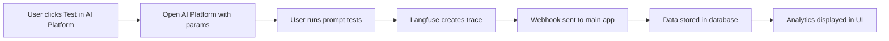

# Technical Integration Guide: SambaTV AI Platform

## Architecture Overview

The integration between the Prompt Library and AI Platform (Langfuse) consists of:
- Frontend components for UI integration
- Backend APIs for data synchronization
- Webhook handlers for real-time updates
- Shared authentication via Google OAuth

## Component Reference

### Frontend Components

#### 1. TestInAIPlatformButton
Location: `/components/test-in-ai-platform-button.tsx`

```typescript
interface TestInAIPlatformButtonProps {
  promptContent: string;
  promptId: number;
  className?: string;
}
```

**Usage:**
```tsx
<TestInAIPlatformButton
  promptContent={prompt.content}
  promptId={prompt.id}
  className="w-full sm:w-auto"
/>
```

**Functionality:**
- Opens AI Platform in new tab
- Passes prompt data via URL parameters
- Encodes content for safe transmission

#### 2. PromptEvaluationDisplay
Location: `/components/prompt-evaluation-display.tsx`

```typescript
interface PromptEvaluationDisplayProps {
  promptId: number;
}
```

**Features:**
- Auto-refreshes every 30 seconds
- Displays cost, quality, latency, and error metrics
- Shows trending insights
- Gracefully handles no data state

### Backend APIs

#### 1. Trace Management
**Endpoint:** `/api/langfuse/traces`
- **POST**: Create trace reference
- **GET**: Fetch trace data

**Request Body (POST):**
```json
{
  "promptId": 123,
  "traceId": "trace-uuid-here"
}
```

#### 2. Evaluation Sync
**Endpoint:** `/api/langfuse/sync`
- **POST**: Webhook receiver for score updates
- **GET**: Manual sync trigger

**Webhook Payload:**
```json
{
  "event": "score.created",
  "data": {
    "traceId": "trace-uuid",
    "score": {
      "name": "quality",
      "value": 0.85,
      "comment": "Good response"
    }
  }
}
```

#### 3. Analytics API
**Endpoint:** `/api/langfuse/analytics`

**Query Parameters:**
- `promptId`: Filter by specific prompt
- `dateFrom`: Start date (ISO 8601)
- `dateTo`: End date (ISO 8601)
- `groupBy`: day|week|month
- `metrics`: comma-separated list (usage,cost,quality,latency,errors)

**Response:**
```json
{
  "analytics": {
    "timeSeries": [...],
    "totals": {
      "cost": 0.0234,
      "avgQuality": 0.87,
      "avgLatency": 1250,
      "errors": 2
    },
    "summary": {
      "totalTraces": 45,
      "uniquePrompts": 12
    }
  },
  "insights": [...]
}
```

### Database Schema

#### langfuse_traces Table
```sql
CREATE TABLE langfuse_traces (
  id UUID PRIMARY KEY DEFAULT gen_random_uuid(),
  prompt_id INTEGER REFERENCES prompts(id),
  langfuse_trace_id TEXT UNIQUE NOT NULL,
  evaluation_scores JSONB,
  total_cost DECIMAL(10,6),
  latency_ms INTEGER,
  token_usage JSONB,
  error TEXT,
  status TEXT,
  created_at TIMESTAMPTZ DEFAULT NOW(),
  updated_at TIMESTAMPTZ DEFAULT NOW()
);
```

### Configuration

#### Environment Variables

**Main Application:**
```env
# Langfuse Integration
LANGFUSE_BASE_URL=https://ai.sambatv.com
LANGFUSE_PUBLIC_KEY=pk-lf-xxx
LANGFUSE_SECRET_KEY=sk-lf-xxx
LANGFUSE_WEBHOOK_SECRET=webhook-secret-xxx
```

**AI Platform (Langfuse):**
```env
# Google OAuth (same as main app)
GOOGLE_CLIENT_ID=xxx
GOOGLE_CLIENT_SECRET=xxx

# AI Models
ANTHROPIC_API_KEY=xxx
GOOGLE_GEMINI_API_KEY=xxx
OPENROUTER_API_KEY=xxx

# Main App Integration
MAIN_APP_URL=https://prompts.sambatv.com
WEBHOOK_URL=https://prompts.sambatv.com/api/langfuse/usage-webhook
```

### Integration Flow

#### 1. User Journey


#### 2. Data Synchronization
- **Real-time**: Via webhooks for immediate updates
- **Batch sync**: Manual sync endpoint for recovery
- **Caching**: 30-second cache for analytics queries

### Authentication Integration

Both applications share the same Google OAuth configuration:

```typescript
// Shared auth configuration
const authOptions = {
  providers: [
    GoogleProvider({
      clientId: process.env.GOOGLE_CLIENT_ID,
      clientSecret: process.env.GOOGLE_CLIENT_SECRET,
      authorization: {
        params: {
          hd: "samba.tv" // Domain restriction
        }
      }
    })
  ]
};
```

### Testing

#### Integration Tests
```javascript
// Test button functionality
describe('TestInAIPlatformButton', () => {
  it('generates correct URL parameters', () => {
    const params = new URLSearchParams({
      prompt: 'Test prompt',
      promptId: '123',
      model: 'claude-3-5-sonnet'
    });
    expect(params.toString()).toContain('prompt=Test+prompt');
  });
});

// Test API endpoints
describe('Analytics API', () => {
  it('returns correct metrics', async () => {
    const response = await fetch('/api/langfuse/analytics?promptId=123');
    const data = await response.json();
    expect(data.analytics).toBeDefined();
    expect(data.analytics.totals).toHaveProperty('cost');
  });
});
```

#### Manual Testing Checklist
- [ ] Button opens AI Platform in new tab
- [ ] Prompt content transfers correctly
- [ ] Traces appear in database after testing
- [ ] Analytics update within 30 seconds
- [ ] Webhook signatures validate correctly

### Monitoring

#### Key Metrics to Track
1. **Integration Health**
   - Webhook success rate
   - API response times
   - Sync lag time

2. **Usage Metrics**
   - Daily active prompts tested
   - Average tests per prompt
   - Model usage distribution

3. **Performance Metrics**
   - Analytics query time
   - Database query performance
   - Frontend component render time

#### Error Handling

Common errors and solutions:

1. **Webhook Signature Invalid**
   ```typescript
   if (!verifyWebhookSignature(payload, signature)) {
     return new Response('Invalid signature', { status: 401 });
   }
   ```

2. **Rate Limiting**
   ```typescript
   // Implement exponential backoff
   const delay = Math.min(1000 * Math.pow(2, attempt), 30000);
   await new Promise(resolve => setTimeout(resolve, delay));
   ```

3. **Database Conflicts**
   ```sql
   INSERT INTO langfuse_traces (...) 
   ON CONFLICT (langfuse_trace_id) 
   DO UPDATE SET updated_at = NOW();
   ```

### Security Considerations

1. **Webhook Validation**: Always verify signatures
2. **CORS Configuration**: Restrict to known domains
3. **Input Sanitization**: Encode all user inputs
4. **Rate Limiting**: Implement on all endpoints
5. **Audit Logging**: Track all integration events

### Deployment

#### Build Process
```bash
# Main app
npm run build

# AI Platform (Langfuse)
cd sambatv-ai-platform
pnpm run build
```

#### Environment-Specific Configs
- **Development**: Use localhost URLs
- **Staging**: Use staging subdomains
- **Production**: Use production domains with SSL

### Troubleshooting

#### Debug Mode
Enable detailed logging:
```typescript
if (process.env.NODE_ENV === 'development') {
  console.log('Langfuse webhook received:', payload);
  console.log('Trace data:', traceData);
}
```

#### Common Issues
1. **No analytics showing**: Check webhook configuration
2. **Authentication fails**: Verify OAuth settings match
3. **Slow performance**: Review database indexes
4. **Missing data**: Run manual sync endpoint

---

Last Updated: January 10, 2025
Version: 1.0.0