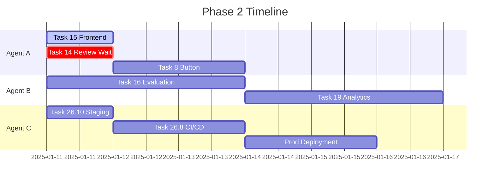

# Phase 2 Task Allocation & Coordination
**Date**: January 11, 2025  
**Orchestrator**: Agent O

## 🎯 Phase 2 Overview

With Task 14 complete and pending review, we're entering Phase 2 of the SambaTV AI Platform development. This phase focuses on advanced features that build upon our solid foundation.

## 📊 Current Status

### Completed Foundation (Phase 1)
- ✅ Infrastructure: Production-ready Docker, SSL, monitoring
- ✅ Backend: 34+ model APIs, authentication, tracing system
- ✅ Frontend: SambaTV branding, playground (80% - Task 14 in review)
- ✅ Quality: 94% score from Agent R initial review

### Active Work
- 🔄 Task 14: Advanced Playground Features (Agent A) - **IN REVIEW**
- 🔄 Task 15: Tracing Frontend Components (Agent A) - **IN PROGRESS**
- ⏳ Task 15: Backend Complete (Agent B) - **READY FOR FRONTEND**

## 🤖 Phase 2 Agent Assignments

### Agent A (Frontend/UI)
**Primary Focus**: Complete tracing visualization, then advanced UI features

1. **Immediate** (After Task 14 approval):
   - Complete Task 15 frontend components (4-6 hours)
     - TraceDashboard component
     - TraceViewer component
     - LiveTraceMonitor component
     - Performance metrics visualization

2. **Next Priority**:
   - Task 8: Implement "Test in AI Platform" Button
     - Integrate with playground features from Task 14
     - Deep link to specific prompt configurations
     - Cross-platform authentication handling

3. **Phase 2 Support**:
   - UI components for evaluation system (Task 16)
   - Analytics dashboard frontend (Task 19)

### Agent B (Backend/API)
**Primary Focus**: Advanced backend features and analytics

1. **Immediate**:
   - Support Agent A with tracing integration queries
   - Prepare for Task 16 implementation

2. **Next Priority**:
   - Task 16: Implement Evaluation System
     - Evaluation framework design
     - Scoring algorithms
     - Batch evaluation support
     - Integration with tracing system

3. **Following**:
   - Task 19: Usage Analytics Dashboard
     - Metrics aggregation
     - Cost analysis APIs
     - Usage patterns tracking
     - Performance analytics

### Agent C (Infrastructure)
**Primary Focus**: Production deployment and optimization

1. **Immediate**:
   - Task 26.10: Deploy Staging Environment
   - Task 26.8: Complete CI/CD Setup

2. **Next Priority**:
   - Production deployment preparation
   - Performance optimization
   - Scaling configuration
   - Monitoring enhancement

3. **Support Role**:
   - Infrastructure for evaluation system
   - Analytics data pipeline setup

### Agent R (Code Review)
**Primary Focus**: Quality assurance and security

1. **Immediate**:
   - Review Task 14 implementation from Agent A
   - Provide feedback or approval

2. **Ongoing**:
   - Review Phase 2 implementations
   - Security audit for new features
   - Performance validation
   - Code quality standards

## 📅 Timeline & Dependencies

## 🔄 Coordination Points

### Daily Sync Points
- **Morning**: Task status check via TaskMaster
- **Midday**: Integration point validation
- **Evening**: Progress update and blocker resolution

### Integration Checkpoints
1. **Agent A ↔ Agent B**: API contracts for evaluation UI
2. **Agent B → Agent C**: Infrastructure needs for analytics
3. **All → Agent R**: Code review submissions

## 🎯 Success Criteria

### Phase 2 Completion Metrics
- [ ] Task 8: Test button fully integrated
- [ ] Task 15: Complete tracing visualization
- [ ] Task 16: Evaluation system operational
- [ ] Task 19: Analytics dashboard live
- [ ] All code reviews passed (90%+ score)
- [ ] Staging deployment validated

### Quality Standards
- Performance: <100ms API response times
- Security: All endpoints authenticated
- Testing: 90%+ coverage for new features
- Documentation: Complete for all new APIs

## 🚀 Next Steps

1. **Agent A**: Continue Task 15 frontend work
2. **Agent B**: Begin Task 16 planning/implementation
3. **Agent C**: Start Task 26.10 staging deployment
4. **Agent R**: Priority review of Task 14
5. **All Agents**: Update TaskMaster with progress

## 📝 Notes

- Task 14 approval unlocks multiple dependent tasks
- Maintain high velocity from Phase 1
- Focus on integration quality between agents
- Regular communication via TaskMaster updates

---

**Status**: ACTIVE  
**Last Updated**: January 11, 2025  
**Next Review**: After Task 14 approval