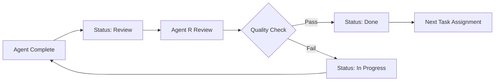

# Post-Task 14 Fix Coordination Plan

**Date**: January 11, 2025  
**From**: Agent O (Orchestrator)  
**Trigger**: After Agent A completes TypeScript fixes

---

## 🎯 IMMEDIATE SEQUENCE (Next 4-6 Hours)

### STEP 1: Agent R Priority Re-review (30 minutes)
**Trigger**: Agent A marks Task 14 as 'review' in TaskMaster

**Agent R Actions**:
1. **Fast-track Review**: Priority review of TypeScript fixes
2. **Verification Checklist**:
   - Compilation errors resolved
   - Rate limiting implemented
   - Functionality preserved
   - Security standards met
3. **Expected Outcome**: 95%+ quality score
4. **Timeline**: 30 minutes maximum for re-review

### STEP 2: Task 14 Completion Celebration (15 minutes)
**Trigger**: Agent R approves Task 14

**Team Actions**:
1. **Update TaskMaster**: Mark Task 14 as 'done'
2. **Milestone Recognition**: Phase 2 → 95% complete
3. **Documentation**: Record completion in communication log
4. **Preparation**: Agent A ready for Task 16

### STEP 3: Agent A Task 16 Immediate Start (15 minutes)
**Trigger**: Task 14 approved

**Agent A Actions**:
1. **Review Agent B's APIs**: Study evaluation endpoint documentation
2. **Component Planning**: Architecture for EvaluationDashboard
3. **Coordinate with Agent B**: Clarify frontend requirements
4. **Start Implementation**: Begin with basic evaluation UI

## 🚀 PHASE 2 COMPLETION SPRINT (Next 1-2 Days)

### Agent A - Task 16: Evaluation Frontend
**Goal**: Complete evaluation UI components
**Timeline**: 4-6 hours
**Dependencies**: Agent B's evaluation APIs (ready)

**Implementation Priority**:
1. **EvaluationDashboard**: List evaluations, scores, trends
2. **EvaluationComparison**: A/B testing interface
3. **Integration**: Add to prompt detail pages
4. **Testing**: Comprehensive evaluation UI testing

### Agent B - Next Assignment Options
**Current Status**: All Phase 2 tasks complete
**Options**:
1. **Task 20**: Basic Prompt Management (next logical task)
2. **Support Agent A**: Help with Task 16 integration
3. **Task 21**: Advanced Analytics (if Task 20 blocked)

### Agent C - Task 24 Continuation  
**Current Status**: Security hardening in progress
**Timeline**: 2-3 days for comprehensive security
**Priority**: Complete container and network security

## 📋 INTEGRATION & TESTING PHASE

### Full Platform Integration Test
**When**: After Task 16 completion
**Scope**: End-to-end platform functionality

**Test Scenarios**:
1. **User Journey**: Login → Browse prompts → Test in playground → View traces → Analyze evaluations
2. **API Integration**: All Agent B backends with Agent A frontends
3. **Performance**: Load testing with Agent C's monitoring
4. **Security**: Agent C's hardening with Agent R's validation

### Production Readiness Checklist
```markdown
Frontend (Agent A):
- [ ] Task 14: Advanced Playground ✅ (after fixes)
- [ ] Task 15: Trace Visualization ✅ 
- [ ] Task 16: Evaluation UI (in progress)
- [ ] Integration testing complete
- [ ] Performance optimized
- [ ] Accessibility validated

Backend (Agent B):
- [ ] Task 15: Tracing System ✅
- [ ] Task 16: Evaluation System ✅
- [ ] Task 19: Analytics Dashboard ✅
- [ ] All APIs documented
- [ ] Performance targets met
- [ ] Security review passed

Infrastructure (Agent C):
- [ ] Task 13: Monitoring ✅
- [ ] Task 24: Security Hardening (in progress)
- [ ] Production deployment ready
- [ ] SSL certificates valid
- [ ] Backup systems operational
- [ ] Scaling configured

Quality (Agent R):
- [ ] All tasks reviewed and approved
- [ ] Security standards validated
- [ ] Performance benchmarks met
- [ ] Documentation complete
- [ ] Deployment authorized
```

## 🎯 PHASE 3 PLANNING

### Remaining High-Priority Tasks
1. **Task 8**: Test in AI Platform Button (Agent A)
2. **Task 20**: Basic Prompt Management (Agent B) 
3. **Task 21**: Advanced Analytics Features (Agent B)
4. **Task 25**: Performance Optimization (Agent C)

### Strategic Considerations
- **Task Dependencies**: Map remaining task relationships
- **Resource Allocation**: Balance workload across agents
- **Timeline Management**: Maintain current high velocity
- **Quality Standards**: Keep 94%+ average score

## 🤝 COORDINATION PROTOCOLS

### Daily Sync Points
**Morning** (Next 3 days):
1. TaskMaster status check across all agents
2. Integration point validation
3. Blocker identification and resolution
4. Priority adjustment if needed

### Communication Triggers
1. **Task Completion**: Immediate TaskMaster update
2. **Blockers Found**: Immediate agent coordination
3. **Quality Issues**: Agent R escalation protocol
4. **Integration Problems**: Cross-agent troubleshooting

### Review Workflow


## 🔍 MONITORING & METRICS

### Success Indicators
- **Task Completion Rate**: Daily progress tracking
- **Quality Scores**: Maintain 90%+ standards  
- **Integration Health**: Cross-agent API success
- **Timeline Adherence**: Stay ahead of schedule

### Risk Mitigation
- **Technical Blockers**: Early identification and resolution
- **Scope Creep**: Focus on MVP requirements
- **Quality Regression**: Immediate Agent R intervention
- **Resource Conflicts**: Dynamic task reallocation

## 📊 BUSINESS IMPACT TRACKING

### Platform Capabilities Delivery
- **Real-time AI Monitoring**: Live trace visualization
- **Advanced Analytics**: Cost optimization insights
- **Quality Evaluation**: Comprehensive scoring system
- **Enterprise Security**: Production-grade hardening

### Competitive Advantage
- **Observability**: Unmatched AI interaction visibility
- **Cost Intelligence**: 20-40% optimization potential
- **Quality Assurance**: Automated evaluation system
- **Operational Excellence**: Enterprise monitoring

## 🎉 SUCCESS CELEBRATION PLAN

### Task 14 Completion
- **Immediate**: Agent A recognition for persistence
- **Team**: Phase 2 milestone achievement
- **Technical**: Playground features fully operational

### Phase 2 Completion (Target: Next 48 hours)
- **Platform**: Complete AI monitoring and analytics
- **Team**: Exceptional 94% quality achievement
- **Business**: Enterprise-grade platform delivered

### Phase 3 Kickoff
- **Advanced Features**: Prompt management and optimization
- **Production Deployment**: Real-world platform operation
- **Team Excellence**: Sustained high-performance delivery

---

**CRITICAL SUCCESS FACTOR**: The TypeScript fixes are the final barrier to Phase 2 completion. Once resolved, the team can accelerate through final integration and move to advanced feature development.

**Expected Outcome**: Complete Phase 2 success within 24-48 hours, positioning for rapid Phase 3 development and production deployment.

**Team Status**: EXCEPTIONAL performance with one small technical hurdle preventing total success! 🚀